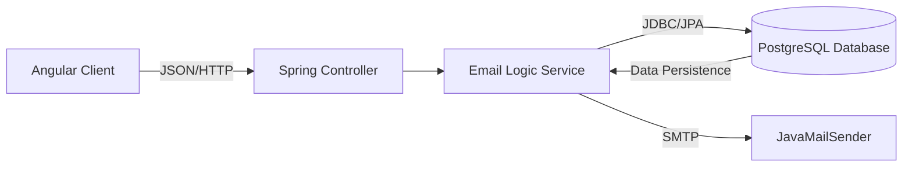

<div align="center">

<a href="https://git.io/typing-svg">
  
</a>

<p>
    
    
    
    
</p>

<a href="https://github.com/YOUR_USERNAME/YOUR_REPO_NAME/archive/refs/heads/main.zip">
  
</a>

</div>

---

## 📧 Project Overview

> A full-stack email simulation platform. Users can register, compose emails, and manage their inbox with real-time updates. The system ensures data persistence using **PostgreSQL** and secure API communication via **Spring Boot**.

---

## ⚡ Functionality


---

## 🛠️ System Architecture

This system follows a layered architecture with a relational database.


# 🚀 Key Features

# 💻 How to Run
1. Database Setup
Ensure PostgreSQL is installed and running. Create a database named email_db.

2. Backend Configuration
Update src/main/resources/application.properties:

Properties

spring.datasource.url=jdbc:postgresql://localhost:5432/email_db
spring.datasource.username=postgres
spring.datasource.password=YOUR_PASSWORD
spring.jpa.hibernate.ddl-auto=update
3. Start Application


# Backend
```
Bash
cd backend
mvn spring-boot:run
Server runs on: http://localhost:8080
```
---


# Frontend
```
cd frontend
npm install
ng serve
Open browser at: http://localhost:4200
```

---

# 👨‍💻 Author
Mohamed G. AbdAlzaher  ✅
--
Mohamed Mahmoud Ali ✅
--
Mohamed Gamal Eldin ✅
--
Anas Mahmoud ✅
--
